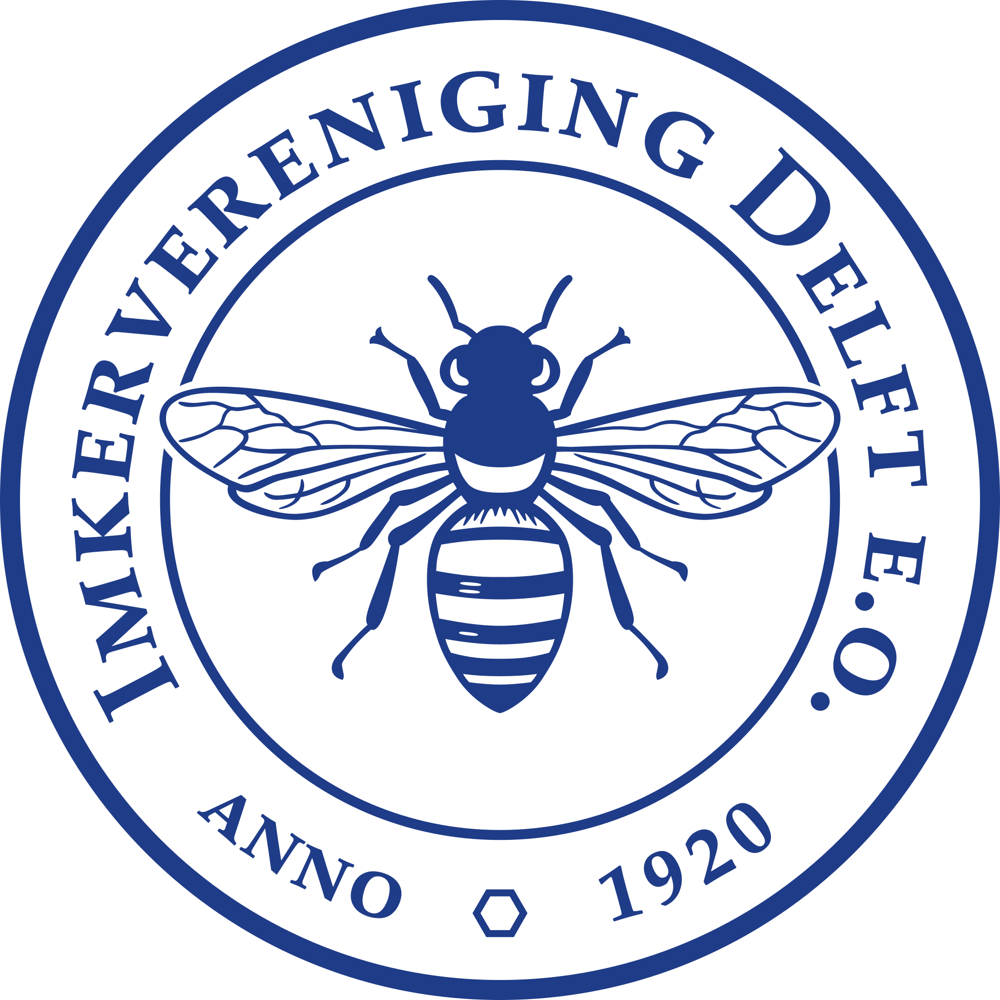
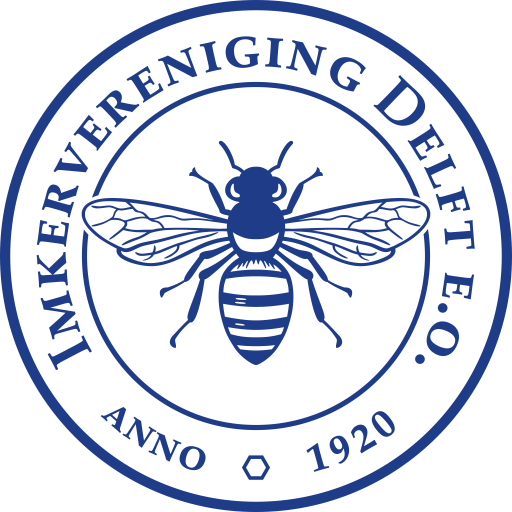
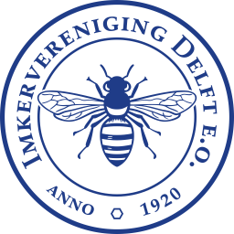
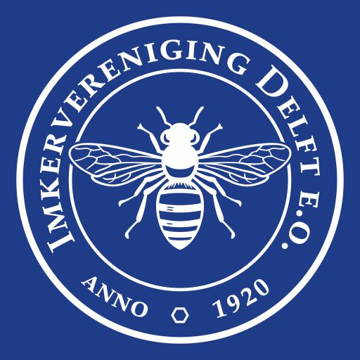

# Imkervereniging Delft e.o. – Official Logo Repository

<p align="center">
  <br>
  SVG preview - width 100%
</p>

<p align="center">
  <br>
  PNG preview — 512 × 512 pixels
</p>

<p align="center">
  <br>
  PNG preview — 256 × 256 pixels
</p>

<p align="center">
  <br>
  PNG preview — 64 × 64 pixels
</p>

<p align="center">
  <br>
  JPG preview — inverted logo 512 × 512 pixels
</p>
---

## Keywords: 
logo, svg, branding, beekeeping, imkervereniging, delft, vector-logo, graphic-design, netherlands

---

## Logo Examples

[Open logo examples page](https://bartek-ha.github.io/logo/index.html)

---

# Nederlands

## Over het Project
Deze repository bevat de officiële logobestanden en gerelateerde ontwerpbestanden van  
**Imkervereniging Delft e.o.**

Het logo is ontworpen om de lange traditie en geschiedenis van de vereniging uit te drukken.  
Het centrale ontwerpidee is gebaseerd op een klassieke **zegel / embleem**, als symbool van continuïteit, vakmanschap en historische identiteit.

---

## Ontwerpcredits
- **Ontwerp:** Marian Bartek
- **Consultatie & artistiek advies:** Beata Lastovko (student at Willem de Kooning Academie, Rotterdam)

---

## Ontwerpkenmerken
- Traditionele ronde zegelvorm
- Gestileerde bij in bovenaanzicht
- Sterke symmetrie en klassieke typografie
- Geïnspireerd door historische imkerstempels en emblemen
- Geschikt voor:
  - drukwerk
  - merchandise
  - digitaal gebruik

---

## Officiële Kleuren – Delfts Blauw

### CMYK
- C: 100
- M: 72
- Y: 0
- K: 38

### RGB
- R: 0
- G: 78
- B: 138

### HEX
- `#004E8A`

---

## Structuur van de Repository

```text
/assets
    /jpg
    /pdf
    /png
    /svg
/source
    /coreldraw
LICENSE
logo_blue.svg — officieel blauw vectorlogo (29 kB)
README.md

```

---

# English

## About the Project
This repository contains the official logo files and related design assets for the organization  
**Imkervereniging Delft e.o.** (Beekeepers Association Delft and surroundings).

The logo was created to reflect the long tradition and heritage of the association.  
The main visual concept is inspired by a traditional **seal/emblem**, symbolizing continuity, craftsmanship, and historical identity.

---

## Design Credits
- **Design:** Marian Bartek
- **Consultation & artistic advice:** Beata Lastovko (student at Willem de Kooning Academie, Rotterdam)

---

## Design Characteristics
- Traditional circular seal layout
- Stylized bee in top view
- Strong symmetry and classical typography
- Inspired by historical beekeeper stamps and emblems
- Designed for:
  - print
  - merchandise
  - signage
  - digital use

---

## Official Colors – Delft Blue

### CMYK
- C: 100
- M: 72
- Y: 0
- K: 38

### RGB
- R: 0
- G: 78
- B: 138

### HEX
- `#004E8A`

---

## Repository Structure

```text
/assets
    /jpg
    /pdf
    /png
    /svg
/source
    /coreldraw
LICENSE
logo_blue.svg — official blue vector logo  (29 kB)
README.md
```
